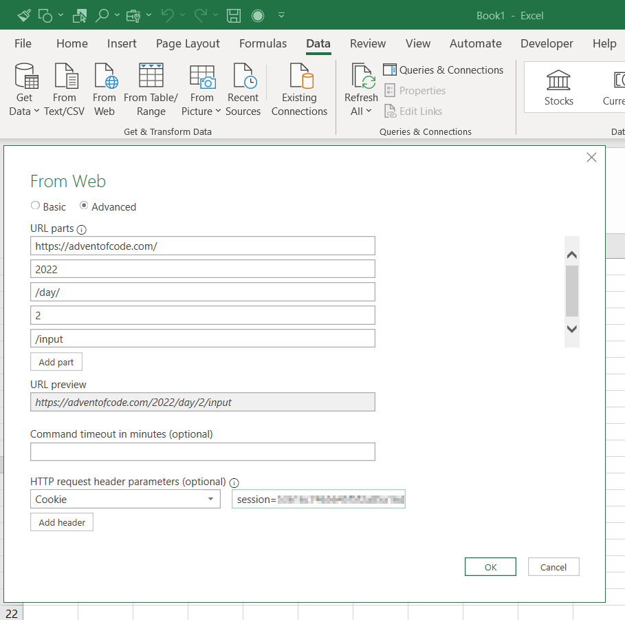
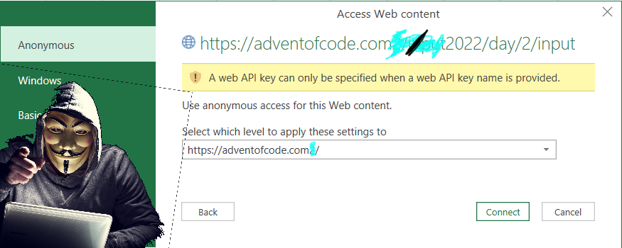
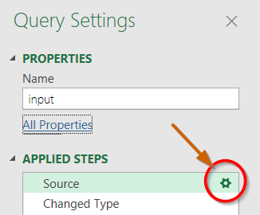
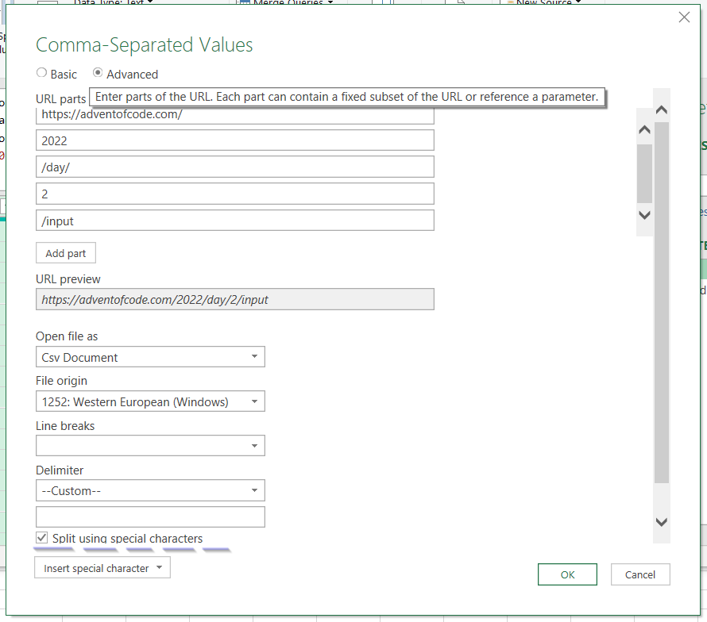
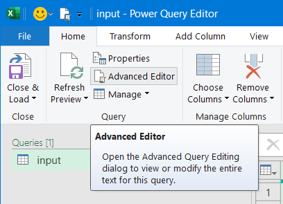
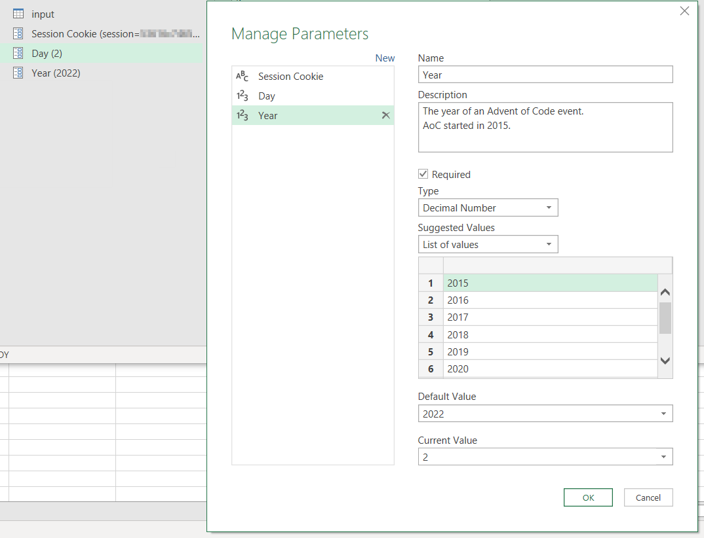
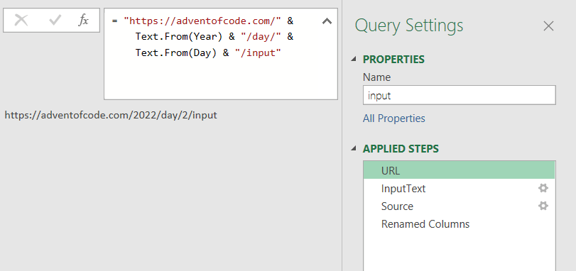

# Day 2 solution in Microsoft Office Excel

Day 2 has us playing Rock Paper Scissors ~~in a beach in front of~~
<!--the jungle where we are supposed to hunt for star fruit with some kind of _magical christmas energy_.-->
Enough setting!
<!--a game whose I struggle to spell correctly without googling (no, wait, I thing I got the name right this time!)-->
Anyways, we are instructed to follow a strategy guide, given by an elf, that tells us when to win, draw or lose.

This feels too boring to solve in `$LANG`.

So, do you have your Office 365 subscription ready?
Good, it's time to launch Microsoft Office Excel!


<!--Good morning-->

Start a blank workbook,
copy your puzzle input to the clipboard and...

No, that's boring, scratch that! We'll make Excel fetch our puzzle input for us this time! That's gonna be way cooler.

## Fetching the puzzle input

Click Data > From Web in the ribbon, then Advanced, then paste
`https://adventofcode.com/2022/day/2/input`
in the URL parts. Wait... why does it says "URL parts"?
Are we supposed to split this up somehow?
Yeah, why not, let's fill it like this, to see where it gets us:


_(You can get your cookies in the DevTools under Storage > Cookies)_



Looks like we have our input!


I'm not done with this part though, because I'm wondering what that "Transform Data" button does...


Oooh what is this?

## The Power Query Editor

Or: an Excel for loading Excel[^1] data

We have many buttons at our disposal that add transformations steps to be applied sequentially to the source data, as is evident by the name "APPLIED STEPS" on the right.

Near the top we see something akin to Excel's formula bar, but the code in it isn't an Excel formula: it's an expression written in a language called [Power Query M](https://learn.microsoft.com/en-us/powerquery-m/m-spec-introduction)[^2].
Each Step on the right has its own M expression describing the transformation done to the data from the previous step.

This last step, "Change Type", is converting Column1 and Column2 to `type text`.
Seems legit.
What is that "Source" step?
Clicking it puts this expression in the formula bar


Looks like those "URL parts" were turned into plain string concatenation. This looks useless. What's the point?
Looking to the right we see this little gear icon on the Source step



Clicking it brings up this window:



Gross. I thought only web developers on Macs suffered from [scrollbar blindness](https://web.archive.org/web/20210409223357/https://svenkadak.com/blog/scrollbar-blindness)
But the strings were put each in its "URL part" text field for us to edit more conveniently. And the tooltip mentions parameters... We'll have to take a look into that later.
Also of note, we can reconfigure the parsing process of our puzzle input.

So, Power Query is a point-and-click interface that has a 1-to-1 correspondence to written expressions in a language called Power Query M (the M stands for Mashup).[^3]
Then there's this button labelled "Advanced Editor" in the ribbon:




So each "Step" corresponds to a binding in this `let ... in` expression, and steps built by Power Query act on the binding of the line above it in the generated M code.
This is functional programming for the masses!

So, with the power of FP in our hands, how can we improve what was given to us by the "From Web" wizard?


### Parameterizing with a capital P

Power Query has the notion of Parameters. Let's create three of those for the year, day, and session cookie of the Advent of Code input!

These parameters appear on the left sidebar next to our "input" query.
Now we should be able to use them to actually parameterize "input".
Let's do that in the Advanced Editor, like the programmers we are, and tidy up the code a little while we are at it:

```f#
let
    URL = "https://adventofcode.com/" & Text.From(Year) & "/day/" & Text.From(Day) & "/input",
    InputText = Web.Contents(URL, [Headers=[Cookie=#"Session Cookie"]]),
    Source = Csv.Document(InputText, 2, "", ExtraValues.Ignore, TextEncoding.Utf8),
    #"Renamed Columns" = Table.RenameColumns(Source,{{"Column1", "Oponent"},
                                                     {"Column2", "Player"}})
in
    #"Renamed Columns"
```

Yay! No more text obfuscation in [Greenshot](https://getgreenshot.org/) to hide my Cookie!

The parameters are accessed by their name. If they have spaces on it, we wrap them in with `#""`.

I put URL Parts concatenation, fetching the input and parsing it as CSV in separate steps, mimicking the way Power Query does.
That way, we can explore each step visually in the editor. Look:


We have generalized fetching input for Advent of Code problems, and it's time we loaded this into Excel, but something is making me itchy.

## You can't spell Functional Programming without Function

We built a Query, but Power Query M looks pretty much like a functional programming language in the vein of F#
<!--(at least that's the syntax highlighting mode I choose for the block of code above),-->
so where are my functions? We even went to the trouble of defining Parameters.

TODO FINISH WRITING THIS

---
[^1]: or PowerBI

[^2]: Like C#, it has a [downloadable spec](https://download.microsoft.com/download/8/1/A/81A62C9B-04D5-4B6D-B162-D28E4D848552/Power%20Query%20M%20Formula%20Language%20Specification%20(July%202019).pdf)

[^3]: Reminds me of some newer languages like [Enso](https://enso.org/)
