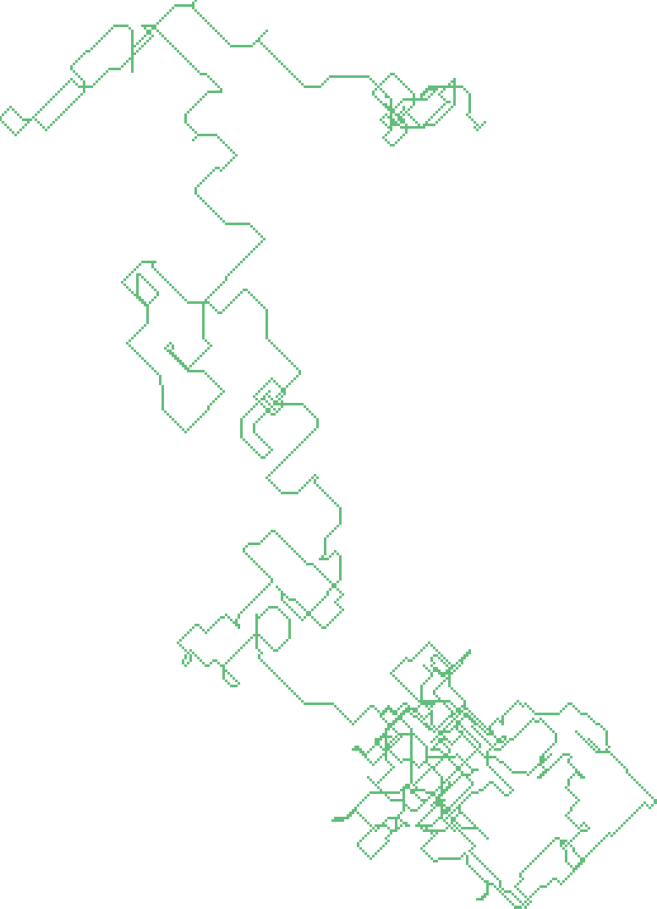

# Notes

## Bugs

I was stuck in a bug for half an hour in Part Two.

The culprit was this line:

```rb
Knot = Struct.new(:x, :y) do
  def touching?(knot)
    (x - knot.x).abs <= 1 and (y - knot.y) <= 1
  end
end
```

I forgot the `.abs` after `(y - knot.y)`!

Having `#abs` being an `Integer` method instead of a function like the built-in
`abs` in Python or `Math.abs` in some other languages made its abcence more
dificult do detect.

## Ruby veredict

Ruby felt idiomatic for this problem.

I still envy Rust's `match` syntax. Ruby's `case/when` and `case/in` feels
verbose.

## Tricks I came up with

```rb
IO.write("| CLIP", ...)
```

is a quick way to write things to the clipboard.

To visualize a bitmap of sorts, I created an array of arrays with either `true`
for the visited positions or `false` otherwise. I transposed and reversed this
to match the ASCII art in the problem statement.

Then, for the small example inputs, I mapped `true false => . #`.

For my personal input, I mapped `true false => 1 0`, joined each cell with a
comma, then joined the outer array with newlines to match the CSV format. Then,
I opened a spreadsheet app, ran an import wizard, shrinked the column widths,
then applied a conditional formatting with color scale. For the picture, I
zoomed out to 25%.


